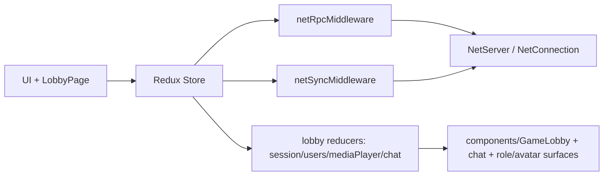
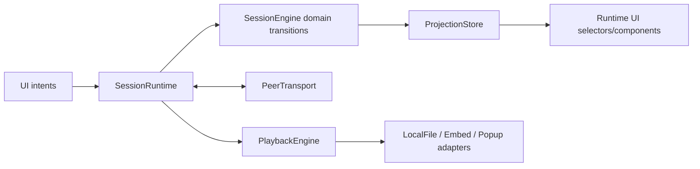

# Runtime cutover map

_Last refreshed: 2026-05-25 against `origin/master` (`bdeeaa67`)._

## Current ownership map (after foundation merges)

| Area | Current owner in shipped flow | Foundation status | Cutover owner |
| --- | --- | --- | --- |
| Session/network orchestration | `containers/LobbyPage.tsx` + Redux middleware chain in `store/appMiddleware.ts` | **Legacy path active by default**; feature-flagged runtime route now owns a `DefaultSessionRuntime` composition/dispose boundary | `SessionRuntime` composition root |
| Shared session state | Redux reducers in `lobby/reducers/session.ts`, `lobby/reducers/users.ts`, `lobby/reducers/mediaPlayer.ts`, `lobby/reducers/chat.ts` | **Legacy path active** | Pure domain transitions (`domain/**`) + runtime projection |
| Pure state and transition primitives | `domain/session-state.ts`, `domain/transitions.ts`, `domain/queue.ts`, `domain/playback-clock.ts`, `domain/event-log.ts` | **Merged and exercised by runtime tests**; duplicate event-log implementation removed | Host `SessionEngine` inside runtime |
| Wire protocol | `protocol/types.ts` + parsers under `protocol/parse-*.ts` | **Merged and parsed by `DefaultSessionRuntime`**; live default net path still uses legacy RPC/diff sync | Runtime wire bridge + transport boundary |
| Transport abstraction | `transport/contracts.ts`, `transport/in-memory-peer-transport.ts`, `transport/webrtc/net-connection-peer-transport.ts`, `transport/legacy-net/*` | **Merged with fake/WebRTC/legacy-net adapters**; not default lobby owner yet | Runtime-owned `PeerTransport` |
| Playback runtime | `playback/engine/playbackEngine.ts`, `playback/adapters/local-file/LocalFileAdapter.ts`, `playback/adapters/embed-extension/*`, `playback/adapters/popup/*`, `playback/runtime/*` | **Merged with adapter selection and lifecycle tests** | Runtime-owned `PlaybackEngine` + adapters |
| UI projection/runtime UI shell | `ui/externalStoreProjection.ts`, `ui/useProjectionSelector.ts`, `ui/session/*`, `ui/session-runtime/*`, `ui/runtime/*` | **Merged behind feature flag with route-owned runtime composition** | Runtime-backed session UI |
| Settings schema migration | `domain/settings/minimalSettings.ts` used by `reducers/settings.ts` and `store/persistStore.ts` | **Merged and wired** | Keep as domain-owned settings core |

## Completed foundation inventory

These are already merged on `origin/master` and should be treated as available building blocks for
future cutover PRs:

- **Guardrails and docs:** `.github/agents/*`, `docs/architecture-migration-plan.md`,
  `docs/legacy-removal-map.md`, this cutover map, and `npm run analyze:architecture`.
- **Pure domain foundation:** username validation, private invite validation, bounded queue
  transitions, playback clock math, canonical bounded system event log, minimal settings schema,
  and `SessionState` transition tests.
- **Protocol foundation:** versioned discriminated wire envelopes, typed client commands and host
  events, parser/error helpers, protocol rejection tests, private invite protocol helpers, and
  runtime bridge mappers for client commands, snapshots, and transition host events.
- **Runtime foundation:** `DefaultSessionRuntime`, bounded runtime diagnostics, host/guest runtime
  flow helpers, in-memory host/guest smoke tests, projection mappers, and explicit `dispose()`
  ownership for transport/playback/runtime objects.
- **Transport foundation:** `PeerTransport` contracts, in-memory transport pair for tests,
  WebRTC `NetConnection` adapter shell, and legacy-net wire transport adapter for strangling the
  existing network stack.
- **Playback foundation:** shared `PlaybackAdapter` contract, `PlaybackEngine`, local-file adapter
  with object URL ownership, embed-extension adapter bridge/parsers, popup fallback adapter,
  runtime adapter selection, and playback runtime controls UI.
- **Runtime UI foundation:** prop-only session shell, route-owned runtime shell composition, runtime
  session shell container, queue runtime UI, settings runtime panel, bounded system event feed,
  invite link helpers/UI, and `SessionRuntimeProvider` projection boundary.
- **Legacy prep:** legacy session projection bridge, legacy chat-to-system-event adapter, removal
  map for chat/avatar/color/role/session-mode/max-user surfaces, fixed 1:1 max-user deletion, and
  dead export pruning.
- **Verification foundation:** architecture analyzer passes on current `master`; runtime, protocol,
  transport, playback, UI, and smoke-test coverage exists for the merged foundations.

## Runtime wiring: current vs target

## Runtime wiring sequence for next implementation wave

1. Add a runtime composition boundary (`runtime/**`) that owns lifecycle for transport, playback engine, and projection store; make `LobbyPage` start/stop this boundary instead of dispatching `NetActions.connect/disconnect`.
2. Bridge live network payloads through typed `WireEnvelope` parsing/serialization (`protocol/**`) before any state mutation; keep host-authoritative sequencing at this boundary.
3. Route host-side commands through `domain/transitions.ts` and emit explicit host events/snapshots; stop using Redux diff replication for session truth.
4. Feed runtime snapshots into `ui/externalStoreProjection.ts`; mount runtime-backed session UI shell before removing legacy lobby state consumers.
5. Apply playback updates via `playback/engine/playbackEngine.ts`; keep adapter lifecycle ownership in runtime (including object URL and embed listener cleanup).
6. Keep settings compatibility through `domain/settings/minimalSettings.ts` while reducing legacy settings surfaces.

## Remaining cutover checklist (concrete)

- [x] Runtime composition root exists and is route-owned (single `dispose()` path on lobby leave/unmount).
- [ ] `network/middleware/rpc.ts` session RPC path replaced by protocol command/event flow.
- [ ] `network/middleware/sync.ts` deep-diff replication replaced by host events + snapshots.
- [ ] `reducers/index.ts` no longer applies `netApplyFullUpdate` / `netApplyUpdate` for session ownership.
- [ ] Runtime wire transport uses `transport/contracts.ts` envelope validation in live flow.
- [ ] Runtime projection replaces direct Redux reads for session participants/queue/playback/system errors.
- [ ] Chat/role/avatar/admin-only behavior removed from session UX and state contracts.
- [x] Playback runtime handles media change lifecycle through `PlaybackEngine` (adapter switch + cleanup).
- [x] Popup adapter implementation exists or popup fallback path is explicitly removed.
- [x] Duplicate domain event-log shapes are consolidated to one canonical runtime event model.

## Deletion targets once runtime path is green

| Delete after cutover | Primary targets |
| --- | --- |
| Redux wire replication | `packages/honeystream-app/src/network/middleware/sync.ts`, `packages/honeystream-app/src/network/middleware/sync.util.ts`, `packages/honeystream-app/src/reducers/deepDiff.ts` |
| Redux RPC/session action transport | `packages/honeystream-app/src/network/middleware/rpc.ts` and RPC-only session action call sites under `packages/honeystream-app/src/lobby/actions/` |
| Legacy chat surface | `packages/honeystream-app/src/lobby/reducers/chat.ts`, `packages/honeystream-app/src/lobby/actions/chat.ts`, `packages/honeystream-app/src/components/chat/**`, `packages/honeystream-app/src/constants/chat.ts` |
| Legacy role/admin/avatar flows | role toggles in `packages/honeystream-app/src/lobby/actions/users.ts` + role state in `packages/honeystream-app/src/lobby/reducers/users.ts`; avatar service/UI paths under `packages/honeystream-app/src/services/avatar.ts` and lobby avatar components |
| Legacy session mode controls | session-mode branches in `packages/honeystream-app/src/reducers/settings.ts` and dependent UI controls once private 1:1 is hard-default; configurable max-user state/UI is already removed |
